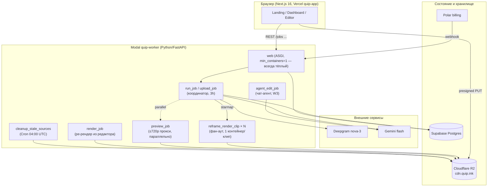
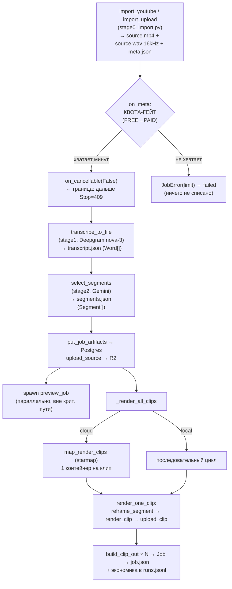
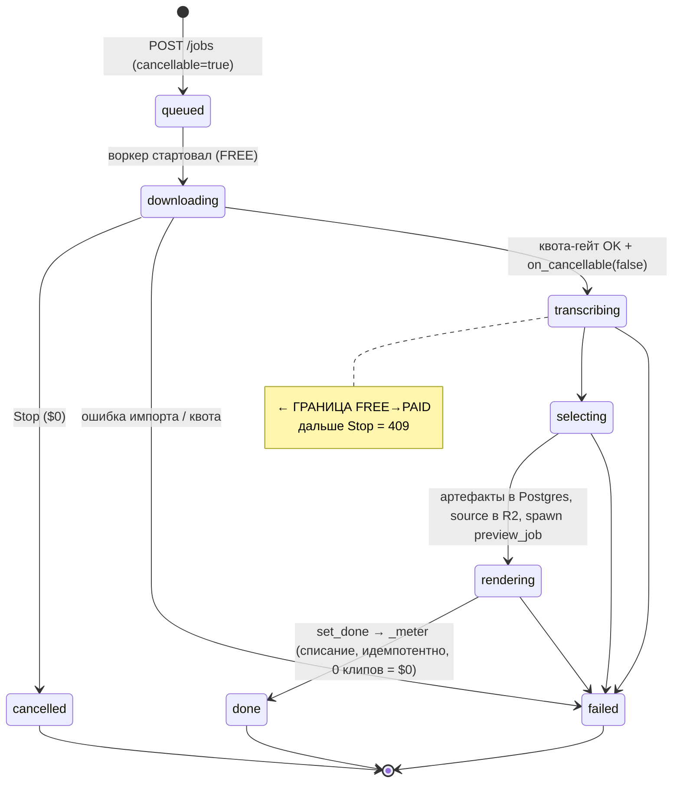
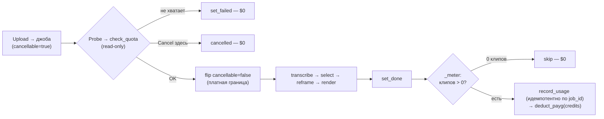
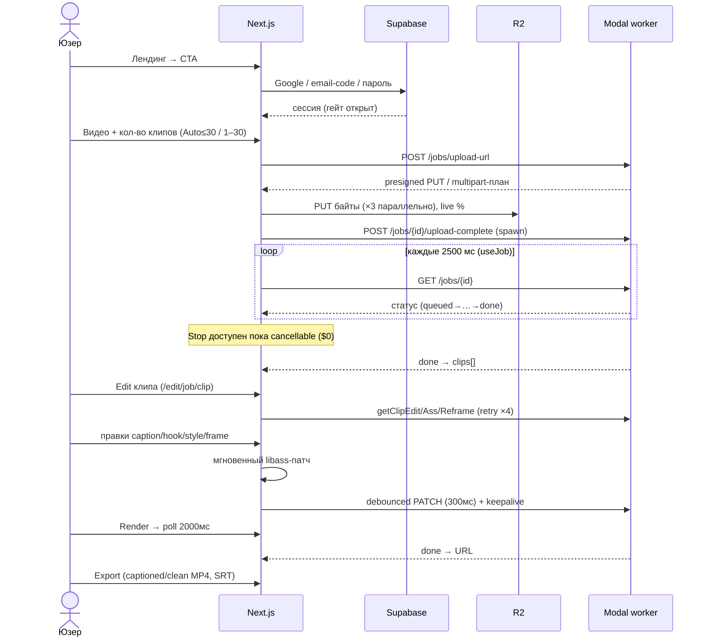

# Quip (ClipFlow) — Полная техническая документация ядра и фич

> **LIVING doc — система целиком (как всё работает вглубь).** Обновляй при изменении поведения (правило docs⇄код
> из CLAUDE.md). Единственный источник правды по «текущей реальности/деплою/ценам» — docs/README.md; этот файл —
> глубокий технический разбор, НЕ baseline реальности.

> **Что это за документ.** Один длинный «учебник» по продукту: как и на чём работает ЯДРО
> (обработка видео), полный список фич и как каждая устроена, с диаграммами и конкретными
> числами. Собран по живому коду (а не по старым докам), каждый факт сверен с `file:line`.
>
> **Зачем.** Чтобы можно было целиком понять систему и думать, что улучшать дальше.
>
> **Отношение к другим докам.** `docs/README.md` остаётся «индексом реальности». Этот файл — его
> расширение вглубь: то, что в README одной строкой, здесь разобрано по косточкам.

---

## Оглавление

0. [TL;DR — суть за минуту](#0-tldr--суть-за-минуту)
1. [Технологический стек](#1-технологический-стек)
2. [Архитектура верхнего уровня](#2-архитектура-верхнего-уровня)
3. [Модель данных (контракты)](#3-модель-данных-контракты)
4. [ЯДРО: пайплайн обработки видео](#4-ядро-пайплайн-обработки-видео)
5. [Оркестрация, жизненный цикл джобы, инфраструктура](#5-оркестрация-жизненный-цикл-джобы-инфраструктура)
6. [AI-фичи: хуки, агент-редактор, интеллект клипов](#6-ai-фичи-хуки-агент-редактор-интеллект-клипов)
7. [Биллинг, кредиты, юнит-экономика](#7-биллинг-кредиты-юнит-экономика)
8. [Фронтенд и полный список фич](#8-фронтенд-и-полный-список-фич)
9. [Сводная таблица всех чисел](#9-сводная-таблица-всех-чисел)
10. [Источник правды и оставшиеся code-caveats](#10-источник-правды-и-оставшиеся-code-caveats)

---

## 0. TL;DR — суть за минуту

**Quip превращает одно длинное видео/подкаст в несколько вертикальных (9:16) коротких клипов**,
каждый — с вшиваемыми субтитрами, цепляющим хуком сверху, оценкой уверенности (`score ∈ [0,1]`) и
человеческим объяснением «почему этот момент работает».

Конвейер из 6 стадий:

```
ИМПОРТ → ТРАНСКРИПЦИЯ → ОТБОР (LLM) → РЕФРЕЙМ (9:16 по спикеру) → СУБТИТРЫ → РЕНДЕР
 yt-dlp/   Deepgram        Gemini       MediaPipe + ASD            ASS/libass   ffmpeg
 ffmpeg    nova-3          flash         (кто говорит → кроп)                   1080×1920
```

Главные инженерные «фишки» ядра:

- **LLM не возвращает таймкоды** — он возвращает _индексы слов_ в заранее пронумерованном
  транскрипте, а точные секунды берутся детерминированно из `words[idx]`. Это структурно убивает
  галлюцинации времени.
- **Кроп 9:16 — не «по лицу», а «по говорящему»**: активный детектор речи (ASD, LR-ASD) выбирает,
  кого держать в кадре на диалоге.
- **Клипы рендерятся ЧИСТЫМИ** (без вшитых субтитров); субтитры — отдельный ASS-слой, который один
  и тот же компилятор отдаёт и в браузерное превью (libass.wasm), и в ffmpeg-экспорт → «превью = то,
  что отрендерится» по построению.
- **Инвариант кадровой сетки (Δ=0)**: геометрия кропа планируется в _нативном_ fps источника, том же,
  в котором режет рендер — иначе на ≠25fps появляются 1-кадровые «вспышки» (а юнит-тесты остаются
  зелёными, потому что фикстуры — 25fps).
- **В облаке рендер — параллельный фан-аут**: один контейнер на клип (`reframe_render_clip` через
  `starmap`), превью-прокси строится параллельно вне критического пути.

Прод живой: фронт на Vercel (`quip-app`, автодеплой с `main`), воркер на Modal (`quip-worker`),
состояние в Supabase Postgres, клипы в Cloudflare R2 (`cdn.quip.ink`), оплата через Polar.

---

## 1. Технологический стек

| Слой                  | Технология                                                                                        | Где                                                          |
| --------------------- | ------------------------------------------------------------------------------------------------- | ------------------------------------------------------------ |
| Фронтенд              | **Next.js 16** (App Router, RSC), TypeScript                                                      | `apps/web` → Vercel `quip-app` (автодеплой на push в `main`) |
| Воркер/API            | **Python 3.12 + FastAPI**, Pydantic-контракты                                                     | `services/worker` → Modal `quip-worker`                      |
| Транскрипция          | **Deepgram `nova-3`** (REST `/v1/listen`)                                                         | `stage1_transcribe.py`                                       |
| LLM-отбор/хуки/агент  | **Google Gemini** (`google-genai` SDK); запинен на `gemini-2.5-flash` (`config.pin_llm_model` коэрсит любой `*-latest`/`gemini-3*` → пин, логируется) | `stage2_select.py`, `agent/*`                                |
| Детекция лиц          | **MediaPipe Tasks** `blaze_face_short_range`                                                      | `stage3_reframe.py`                                          |
| Активный спикер (ASD) | **LR-ASD** (`pretrain_AVA.model`, 0.84M, CPU/torch)                                               | `app/asd/*`                                                  |
| Сцены/кадры           | **PySceneDetect** `ContentDetector`                                                               | `stage3_reframe.py`                                          |
| Видео-обработка       | **ffmpeg ≥7** (статик-сборка John Van Sickle, не apt), libx264                                    | `stage0/stage5`                                              |
| Субтитры              | **ASS** (рендер) + **libass.wasm** (браузер-превью) из одной модели                               | `stage4_captions.py`, `editor/captions_v2.py`                |
| Состояние/auth        | **Supabase Postgres** (`qiagetbnsssvbiowuxpp`) + Supabase Auth (Google OAuth + email)             | `cloud_state.py`, `apps/web`                                 |
| Хранилище             | **Cloudflare R2** (bucket `quip`, CDN `cdn.quip.ink`), S3 API через boto3                         | `storage.py`                                                 |
| Оплата                | **Polar.sh** (production), Standard Webhooks                                                      | `polar.py`                                                   |
| Аналитика             | Vercel Analytics + Yandex.Metrica (id `109870225`)                                                | `apps/web`                                                   |
| Типы                  | **codegen**: `models.py` → JSON Schema → `packages/shared/src/types.ts` (`just types`)            | `models.py`, `export_schema.py`                              |

Локальный dev — тот же код в «локальном режиме»: диск + SQLite вместо R2 + Postgres (см. §5.1).

---

## 2. Архитектура верхнего уровня



**Ключевая идея:** `web`-контейнер тонкий и **всегда тёплый** (`min_containers=1` — нет холодного старта
на первом запросе) — тяжёлую работу он **спавнит** в отдельные долгоживущие Modal-функции (иначе
BackgroundTask умер бы посреди нарезки). Загрузка файла идёт **напрямую браузер→R2** (presigned), минуя воркер.

---

## 3. Модель данных (контракты)

Единый источник типов — `services/worker/app/models.py` (Pydantic). Из него codegen-цепочка генерит
JSON Schema → TypeScript (`packages/shared`). **Руками TS не пишем.** Все времена — секунды (float),
абсолютные от начала source.

### Внутренние модели пайплайна

- **`Word`** `{text, start, end, confidence?}` — слово с word-level таймингами. Фундамент всего:
  субтитры, тримминг, маппинг офсетов.
- **`Transcript`** `{language, duration, words[]}` — `words` отсортированы по `start`.
- **`Segment`** `{start, end, reason, score∈[0,1], type, hook?, why_works?, hook_style?}` — выбранный
  момент, границы снэпнуты к словам.
- **`CropWindow`** `{t, x, y, w, h}` — окно кропа 9:16 в пикселях source.
- **`Clip`** — внутреннее представление готового клипа (пути к артефактам + `cost_usd`, `latency_s`).

### WIRE-модели (API web↔worker)

- **`ClipOut`** — клип в ответе API: `start/end/duration` в координатах source, `reason`, `type`,
  `score`, `video_url`, `thumbnail_url?`, `transcript`, `words[]`, `hook?`, `why_works?`, `hook_style?`.
- **`Job`** — состояние задачи целиком (ответ `GET /jobs/{id}`): `id, status, stage, progress,
source_kind, error?, clips[], metrics?, cancellable`.
- **`Metrics`** `{cost_usd, duration_sec, elapsed_sec}` — экономика прогона на виду в UI.

### Enums (объяснимость как продукт)

- **`ClipType`**: `hook | emotional_peak | complete_thought | strong_quote` (тип момента → цвет чипа).
- **`JobStatus`**: `queued → downloading → transcribing → selecting → rendering → done`, плюс
  `failed`, `cancelled`.
- **`SourceKind`**: `youtube | upload`.

### EDITOR-модели (не-деструктивный «рецепт» клипа)

Редактор правит **рецепт**, а не видео:

- **`ClipEdit`** `{id, version, source_intervals[], captions, reframe_overrides[], aspect}` —
  версионируется (optimistic-lock).
- **`CaptionTrack`** `{style, highlight?, replies[], hook?, burn}` — субтитры + караоке + реплики +
  опц. топ-текст (хук).
- **`CaptionStyle`** — дефолты: `font=Montserrat, size=90, outline_w=6, shadow=2, margin_v=260,
alignment=2 (низ-центр), uppercase=true`.
- **`HookOverlay`** — дефолты: `font=Unbounded, size=66, alignment=8 (верх), box_color=#FF5A3D
(коралл-бренд), margin_v=150, full_clip=true, animation=none`.
- **`HighlightStyle`** — караоке-подсветка активного слова: 9 анимаций
  (`karaoke_fill/pop/bounce/punch/fade/spring/blur_in/color_sweep/none`).
- **`CaptionReply`** `{word_refs[], text_override?, hidden, emphasis_refs[]}` — реплика-чанк 3–5 слов.

### АГЕНТ- и TIMELINE-модели

- **`AgentRun`** `{run_id, job_id, clip_id, status, events[], error?, cancellable}` — прогон чат-агента
  над одним клипом; статусы `running/done/failed/cancelled`.
- **`AgentEvent`** `{role: user|thinking|action|agent|error, text, action_kind?, before?, after?}`.
- **`TimelineData`** `{duration, segments[], words[]}` — данные таймлайн-редактора (все кандидаты ИИ).
- **`Chapter`/`ChaptersData`** — AI-карта видео (главы покрывают видео непрерывно), кэш `chapters.json`.

---

## 4. ЯДРО: пайплайн обработки видео

> Scope: чистые функции `services/worker/app/pipeline/*`, движок ASD `app/asd/*`, компилятор субтитров
> `app/editor/captions_v2.py`, и склейка `run.py`/`dispatch.py`. Все числа сверены с `file:line`.

### 4.0. Сквозной поток данных

Батч-путь оркестрируется `run_pipeline` (`run.py:165`):



**Важно:** субтитры (Stage 4) в батч-пути **НЕ вшиваются** — клип остаётся чистым навсегда. Субтитры
компилируются отдельно (`stage4_captions.build_ass` — legacy фикс-стиль, или `captions_v2.compile_ass`
— WYSIWYG-редактор) и накладываются в браузере / при экспорте.

### 4.1. Stage 0 — Импорт / Probe (`stage0_import.py`)

Превращает YouTube-URL или загруженный файл в 3 артефакта в `data/<job_id>/`.

| Параметр                 | Значение                                                                                                                           | Локация               |
| ------------------------ | ---------------------------------------------------------------------------------------------------------------------------------- | --------------------- |
| Выход `SourceMeta`       | `job_id, source, url, title, duration(s), fps, width, height`                                                                      | `stage0_import.py:33` |
| YouTube-селектор         | `bestvideo[height<=1080][vcodec^=avc1]+bestaudio[ext=m4a]/…/best` (H.264 предпочтительно — AV1 в 2–5× медленнее на рефрейме)       | `:158`                |
| yt-dlp extras            | `--merge-output-format mp4`, `--no-playlist`, `--remote-components ejs:github` (nsig-челлендж нужен Deno+EJS), `--max-filesize 2G` | `:162-167`            |
| Извлечение аудио         | `ffmpeg -vn -ac 1 -ar 16000 -c:a pcm_s16le` (16 кГц моно)                                                                          | `:217`                |
| Гард «нет звука»         | `has_audio_stream` → внятный `JobError` («Quip режет по речи…»)                                                                    | `:186, 211`           |
| Лестница ремукса аплоада | `-c copy` → `-c:v copy -c:a aac` (mkv/Opus) → полный `libx264 -preset veryfast -crf 20`                                            | `:332-376`            |
| `parse_fps`              | `'30000/1001'`→29.97; округление до 3 знаков; **отвергает fps ≤ 0** (иначе ZeroDivision в сетке)                                   | `:49-75`              |
| Потолок длины            | `MAX_SOURCE_MINUTES = billing.MAX_VIDEO_MINUTES` = **180 мин (3 ч)**                                                               | `:30, 295`            |
| Превью-прокси            | `scale=-2:720, libx264 -preset veryfast -crf 30, aac 96k, +faststart` (без апскейла)                                               | `:237`                |

### 4.2. Stage 1 — Транскрипция (`stage1_transcribe.py`)

`source.wav` → `Transcript` (word-level, секунды). Провайдер-свапаемый, реализован только Deepgram.

| Параметр           | Значение                                                                                  | Локация        |
| ------------------ | ----------------------------------------------------------------------------------------- | -------------- |
| Endpoint           | `https://api.deepgram.com/v1/listen` (стабильный REST, не SDK v7)                         | `:23`          |
| **Модель**         | **`nova-3`**                                                                              | `config.py:38` |
| Параметры          | `smart_format=true, punctuate=true, diarize=false`; `language` или `detect_language=true` | `:87-96`       |
| Таймаут            | connect 30s, write=None (3ч WAV ≈ 350 МБ), read 600s                                      | `:106`         |
| Текст слова        | `punctuated_word` (fallback `word`); сортировка по `start`                                | `:46, 62`      |
| Стоимость          | `DEEPGRAM_NOVA_USD_PER_MIN = 0.0043` (≈$0.258/ч)                                          | `:26`          |
| Без тихих фолбэков | нет `metadata.duration` → `JobError` (раньше был тихий `0.0`)                             | `:68`          |

### 4.3. Stage 2 — Отбор (`stage2_select.py`) — главный гейт качества

`Transcript` → `list[Segment]`. Gemini получает **пронумерованный по словам** транскрипт и возвращает
**диапазоны индексов слов** (не таймкоды) → секунды берутся детерминированно из `words[idx]`.

| Параметр            | Значение                                                                                              | Локация                        |
| ------------------- | ----------------------------------------------------------------------------------------------------- | ------------------------------ |
| **Модель LLM**      | запинена на **`gemini-2.5-flash`** (`config.pin_llm_model` коэрсит любой `*-latest`/`gemini-3*` → пин, логируется) | `config.py:47`, `pin_llm_model` |
| Fallback-модель     | `gemini-2.5-flash-lite` (`gemini-2.0-flash` мёртв с 2026-06-01)                                       | `:30`                          |
| Thinking            | `thinking_budget=0` — выключен (thinking-токены обрезали JSON)                                        | `:376`                         |
| `max_output_tokens` | 16000 (4× запас даже при 3ч×30 клипов)                                                                | `config.py:48`                 |
| Ретраи              | primary 4 попытки, backoff `min(2^n,30)`s; permanent `{400,401,403,404,422}` — сразу raise            | `:28, 229, 382-415`            |

**Числа отбора:**

| Кнопка                   | Дефолт                                                   | Локация        |
| ------------------------ | -------------------------------------------------------- | -------------- |
| Мин. длительность клипа  | **15 с** (`clip_min_sec`)                                | `config.py:61` |
| Макс. длительность клипа | **60 с** (`clip_max_sec`); промпт-sweet-spot ~20–45 с    | `config.py:62` |
| Клипов по умолчанию      | **8** (`max_clips`)                                      | `config.py:66` |
| Потолок клипов           | **`resolve_max_clips` → [1, 30]** (UI «Auto» шлёт 30)    | `:42`          |
| Tail-pad                 | **0.3 с** (тишина для чистого лупа)                      | `config.py:64` |
| Score                    | clamp в [0,1] (модель оценивает «как зайдёт standalone») | `:37`          |

**Качество конца («W1») — `snap_end_index`** (`:55`): лестница приоритетов чистой концовки —
(1) слово уже завершает предложение `.?!` → оставить; (2) ближайший `.?!` в **+8 словах** → продлить;
(3) иначе снэп к **самой большой паузе ≥ 0.35 с**; (4) иначе без изменений (tail-pad сглаживает луп).
`snap_start_index` (`:87`) — зеркально для начала. `pad_clip_end` (`:129`) — продлевает конец, но не за
начало следующего слова и не за длительность source. `postprocess` (`:158`): валидация типа → снэп →
маппинг в секунды → duration-гейт на речи (до паддинга) → `resolve_overlaps` (greedy по убыванию score)
→ top-`max_clips`. Плохие сегменты пропускаются, не падают.

### 4.4. Stage 3 — Рефрейм 9:16 (`stage3_reframe.py` + `asd_reframe.py` + `stage3_speaker.py` + `asd/scorer.py`)

Для одного сегмента строит `TrackRegion[]` (одна стабильная мода кропа на шот). Здесь живёт
**инвариант кадровой сетки**.

```
aligned_start = round(start * fps) / fps              # тот же origin, что у render_clip
total_frames  = round((end - aligned_start) * fps)    # fps = НАТИВНЫЙ fps источника (meta.fps)
cuts   = detect_scene_cuts(..., fps, threshold=27)    # ← нативный fps
shots  = build_shots_frames(cuts, total_frames)       # в кадрах
tracks_native = score_tracks_in_segment(..., face_fps=25, crop_scale=0.55)  # ASD @25
tracks = [resample_track(t, 25, fps) for t in tracks_native]                # 25 → нативный
regions = merge_short_regions(plan_regions(shots, tracks, fps, ...), 1.5)   # ← нативный fps
```

**Детекция сцен (`detect_scene_cuts`, `:532`):** сегмент перекодируется в temp h264 на нативном fps,
затем PySceneDetect `ContentDetector(threshold=27.0)`. Критичная коррекция `-1`:
`max(1, s[0].get_frames() - 1)` — PySceneDetect помечает рез на 1 кадр позже сетки декода рендера;
без `-1` один кадр нового шота держит старый кроп = вспышка (поймано глазами).

| Параметр             | Значение                                                          | Локация                |
| -------------------- | ----------------------------------------------------------------- | ---------------------- |
| Модель лиц           | MediaPipe `blaze_face_short_range` (float16), conf 0.5            | `:77, 650`             |
| ASD fps (фиксирован) | **25** (`reframe_face_fps`) — требование LR-ASD                   | `config.py:79`         |
| ASD-модель           | LR-ASD `pretrain_AVA.model` (0.84M), CPU, lazy torch              | `asd/scorer.py:16`     |
| Размер кропа лица    | 224×224 BGR; `crop_scale=0.55`                                    | `asd_reframe.py:54`    |
| IOU-трекинг          | greedy, `iou_thres=0.5, num_failed_det=10, min_track=10`          | `stage3_speaker.py:39` |
| Оптимизация          | `should_score_asd(n) = n ≥ 2` — клипы с 1 треком пропускают torch | `stage3_speaker.py:16` |

**ASD-контракт 25fps (`asd/scorer.py:48`):** `vf = vf[:int(round(length*25))]`, `af = af[:round(length*100)]`
— жёсткое отношение **4:1 видео:аудио**. Поэтому ASD держится 25fps, а треки `resample_track`-ятся в
нативный fps до `plan_regions`.

**`plan_regions` — мода на шот (`:308`):** для каждого шота: `fit`/`fill` глобальные оверрайды; иначе
для широкого шота (≥2 трека, разнесённых > ширины кропа) — **гибрид**: (1) явный спикер
(`max speak ≥ wide_speak_min=0.3`) → fill на спикере; (2) иначе `fit` (широкий шот без явного спикера
кадрируется целиком). Для нешироких → `fill` на `_pick_target`. **Непрерывность
`cx`:** `prev_fill_end_cx` сидит EMA следующей fill-региона → панорама плавно скользит между шотами
(анти-телепорт). `merge_short_regions` — регион короче `reframe_min_hold_sec=1.5 с` поглощается предыдущим
(убивает мерцание на быстрых резах). Сглаживание: EMA `cx[i] = cx[i-1] + 0.15·(raw - cx[i-1])`.

> **Split-режим УБРАН из MVP** (`config.reframe_split_enabled=False`; legacy `'split'` коэрсится в `'fit'`).
> Auto-моды теперь только **fill / wide(fit)**. Бывшая split-ветка (верх/низ из 2 разнесённых треков)
> в коде осталась, но не достижима в MVP.

### 4.5. Stage 4 — Субтитры

Два компилятора:

**(A) Legacy батч-стиль (`stage4_captions.build_ass`, `:118`)** — бренд-нейтральный фикс-ASS:
PlayRes 1080×1920, **Montserrat 90**, Outline 6 / Shadow 2, `Alignment=2` (низ-центр), **MarginV 260**,
`.upper()`. Группировка слов: `max_words=5`, `max_gap=0.4 с`, `max_dur=2.5 с` (или конец предложения).
Clip-time: `round(max(0, t_source − segment_start), 3)` — единственная точка офсета (R3). Экранирование:
`\`→U+29F5, `{`→`\{`, `}`→`\}` (анти tag-injection, byte-identical libass/ffmpeg).

**(B) Редакторный WYSIWYG (`editor/captions_v2.compile_ass`, `:283`)** — один `CaptionTrack` → ASS,
который потребляют **И** libass.wasm-превью, **И** ffmpeg-экспорт. Караоке через нативные `{\k}`;
анимации слов/хука — **только layout-нейтральные** (`\fscy`/`\alpha`/`\blur`/`\1c`, никогда `\fscx`/`\fsp`,
которые бы перевёрстывали строку). `burn=False` гасит нижние субтитры (видео уже с вшитыми), но
оставляет хук. Шрифты общие с превью (`fonts/` ⇄ `apps/web/public/libass/fonts`).

### 4.6. Stage 5 — Рендер (`stage5_render.py`)

source + `TrackRegion[]` (+ опц. ASS) → `clips/<clip>.mp4`. Два движка за `render_clip` (`:448`).

| Параметр           | Значение                                                                           | Локация    |
| ------------------ | ---------------------------------------------------------------------------------- | ---------- |
| Размеры (9:16)     | **1080×1920** (также 1:1=1080×1080, 4:5=1080×1350, 16:9=1920×1080)                 | `:42`      |
| Энкодер (движок A) | `libx264 -preset veryfast -crf 20 -pix_fmt yuv420p`; `aac -b:a 128k`; `+faststart` | `:312-324` |
| Aligned start      | `round(seg_start * fps) / fps` (**обязан совпадать с `reframe_segment`**)          | `:474`     |
| Кадры тримма       | `f0 = round(t0*fps), f1 = round(t1*fps)` (кадрово-точно)                           | `:289-296` |
| fill-цепочка       | `crop=W:H:<x_expr>:0, scale=out:flags=lanczos`                                     | `:237-243` |
| fit-цепочка        | blur-фон (`gblur sigma=20`) + overlay по центру                                    | `:208-215` |
| split-цепочка      | два `crop` → `scale=out_w:out_h/2` → `vstack` (**legacy — split убран из MVP, недостижимо**) | `:216-233` |
| Стык регионов      | попарный `concat` = **жёсткий рез** (xfade убран — читался как zoom-вспышка)       | `:246`     |
| Crop X-выражение   | `build_fill_crop_expr` = **кусочно-ЛИНЕЙНЫЙ** рамп (плавный пан)                   | `:78`      |

Движок B (`render_frame_by_frame`, `:363`): cv2 покадрово → pipe raw BGR → ffmpeg stdin (медленнее,
пиксельно точно). Дефолт `reframe_engine="A"`.

### 4.7. Инвариант кадровой сетки (Δ=0) — почему важно и где ломается

**Инвариант:** сетка геометрии рефрейма (резы → шоты → границы регионов) ДОЛЖНА быть в **нативном fps
источника** — том же, в котором режет `render_clip`.

**Почему Δ=0:** граница региона = `t0 = cut_frame / fps`. Рендер считает кадр тримма как `round(t0 * fps)`.
Поскольку `t0 = cut_frame/fps`, получаем `round(t0*fps) = cut_frame` **точно** → рез ровно по реальной
смене сцены → ни одного кадра нового шота со старым кропом → **вспышки нет физически**.

**Где ломается (≠25fps):** старый баг планировал резы в жёстко зашитой сетке 25fps, пока рендер резал в
нативном fps. На 29.97fps `round(16.72 * 29.97) = 501`, но `round(36.52 * 29.97) = 1094.5` — попадание
_между кадрами_ → промах ±1 кадр → вспышка. На 25.0fps-фикстурах невидимо → **юнит-тесты остаются
зелёными**. Это и есть ловушка, о которой предупреждает `docs/REFRAME_FPS_GRID_INVARIANT.md`.

**Функции, что обязаны быть в синхроне (все на нативном `fps`, НЕ `face_fps`):** `detect_scene_cuts`,
`build_shots_frames`, `plan_regions`; `aligned_start` идентичен в `reframe_segment` и `render_clip`; ASD
держится `face_fps=25` и `resample_track`-ится 25→нативный; `*25`/`*100` в `asd/scorer.py` — контракт
модели, не магия.

> ⚠️ Не закрыто этим фиксом: **редакторный путь** (`editor/reframe_cache.py` → `resolve_regions` +
> `render_timeline`) имеет отдельный планировщик резов в секундах — может рассинхрониться на ≠25fps,
> если вспышки появятся именно в редакторе.

### 4.8. ДВА СЛОЯ reframe: вычисление vs ЗАПЕЧЁННЫЕ регионы (cache-clear gotcha)

Реальные границы шотов и моды кропа **ПЕРСИСТЯТСЯ** в `job_artifacts.reframe_regions` (миграция 0013)
при первом прогоне. Редактор/превью читают эти **запечённые** регионы через `/reframe` fast-path
**БЕЗ пересчёта** `plan_regions`. → Любая правка wide/tight/split-логики в коде **НЕВИДИМА** на готовых
клипах, пока кэш не сброшен.

> **⚠️ Cache-clear gotcha (стоил дней — НЕ повторять):** после деплоя правки reframe-логики ОБЯЗАТЕЛЬНО
> сбрось кэш регионов, иначе «фикс не работает»:
> `update public.job_artifacts set reframe_regions = null;` (ПОСЛЕ деплоя). Подробности —
> `docs/REFRAME_FPS_GRID_INVARIANT.md` (инвариант сетки) и правило reframe в `CLAUDE.md`.

---

## 5. Оркестрация, жизненный цикл джобы, инфраструктура

### 5.1. Dual-mode: локальный dev vs облако

Весь бэкенд работает в двух режимах из одного кода. Гейт — `cloud_state.cloud_enabled()` =
`STORAGE_BACKEND=r2` **И** `SUPABASE_URL` **И** `SUPABASE_SERVICE_ROLE_KEY`. Отдельный гейт
`dispatch.modal_spawn_enabled()` = `MODAL_SPAWN=="1"` решает спавн-vs-BackgroundTask.

| Аспект                               | Локально (dev)                                | Облако (Modal `quip-worker`)                             |
| ------------------------------------ | --------------------------------------------- | -------------------------------------------------------- |
| Состояние джоб/правок                | SQLite `services/worker/tmp/jobs.db`          | Supabase Postgres (PostgREST + service_role)             |
| Хранилище клипов                     | диск `data/<job>/`, отдаётся на `/media`      | Cloudflare R2 (`{job}/{clip}.mp4` и т.д.)                |
| Артефакты (meta/segments/transcript) | JSON на диске                                 | Postgres `job_artifacts`                                 |
| Диспатч тяжёлой работы               | FastAPI `BackgroundTasks` (в том же процессе) | `dispatch.spawn(...)` → отдельная Modal-функция          |
| Рендер клипов (3–5)                  | **последовательный цикл**                     | **параллельный фан-аут** (`reframe_render_clip` starmap) |
| Превью-прокси                        | inline после клипов (тот же процесс)          | отдельный `preview_job`, параллельно                     |
| Кэш транскрипта                      | content-addressed JSON на диске               | Postgres `transcript_cache` (`audio_sha+provider+model`) |
| URL клипа                            | относительный `clips/<id>.mp4`                | постоянный CDN `https://cdn.quip.ink`                    |

### 5.2. Полный список HTTP-эндпоинтов (`main.py`)

| Метод     | Путь                                                                     | Назначение                                                                              |
| --------- | ------------------------------------------------------------------------ | --------------------------------------------------------------------------------------- |
| GET       | `/healthz`                                                               | Liveness `{ok, version}`, без auth                                                      |
| GET       | `/usage`                                                                 | План + остаток минут + PAYG для UsageMeter                                              |
| POST      | `/jobs`                                                                  | Создать джобу из URL → квота-гейт → spawn `run_job`                                     |
| POST      | `/jobs/upload`                                                           | **Legacy/dev** multipart через воркер → `upload_job`                                    |
| POST      | `/jobs/upload-url`                                                       | Direct→R2: presigned PUT (≤100МБ) / multipart-план (>100МБ) / `{local:true}`; квота тут |
| POST      | `/jobs/{id}/upload-complete`                                             | После PUT: собрать multipart → spawn `upload_job`                                       |
| POST      | `/jobs/{id}/upload-abort`                                                | Отмена/очистка брошенного multipart                                                     |
| POST      | `/webhooks/polar`                                                        | Polar-вебхук → план / PAYG-кредиты (подпись)                                            |
| GET       | `/jobs/{id}`                                                             | Статус (re-presign `r2://`-маркеров)                                                    |
| POST      | `/jobs/{id}/cancel`                                                      | Stop: отмена в FREE-фазе ($0); 409 за платной границей                                  |
| GET       | `/jobs/{id}/source.mp4` · `/preview.mp4`                                 | Полный source / лёгкий прокси (фолбэк на source)                                        |
| GET       | `/jobs/{id}/timeline` · `/chapters`                                      | TimelineData / AI-карта видео (кэш + bg-генерация)                                      |
| GET/PATCH | `/jobs/{id}/clips/{clip}/edit`                                           | ClipEdit (создаёт дефолт при первом вызове) / патч                                      |
| GET       | `…/clips/{clip}/ass` · `/export.srt`                                     | ASS для libass-превью / SRT-экспорт                                                     |
| GET       | `…/clips/{clip}/export/clean.mp4` · `/captioned.mp4`                     | Синхронный рендер без/с субтитрами                                                      |
| POST      | `…/clips/{clip}/edit/{trim,add-section,extend,crop,aspect,set-interval}` | Правки рецепта                                                                          |
| POST      | `…/clips/{clip}/hook/regenerate`                                         | Регенерация хука (узкий Gemini, W4)                                                     |
| POST/GET  | `…/clips/{clip}/agent/{start,active,{run},{run}/cancel}`                 | Чат-агент (W3)                                                                          |
| POST/GET  | `…/clips/{clip}/render`                                                  | Async пре-бейк / статус рендера                                                         |
| GET       | `…/clips/{clip}/{reframe,analysis}`                                      | План рефрейма / интервалы+слова                                                         |
| GET/POST  | `/presets` · `…/apply-preset`                                            | Пресеты субтитров                                                                       |

CORS: regex `*.quip.ink`, любой `*.vercel.app`, `localhost:3000`. Auth: Bearer JWT (Supabase JWKS) или
dev-заголовок `X-User-Id`.

### 5.3. Modal-функции (`deploy/modal/worker.py`)

| Функция                 | Роль                                          | timeout         | cpu/mem    | Расписание                    |
| ----------------------- | --------------------------------------------- | --------------- | ---------- | ----------------------------- |
| `web`                   | FastAPI, **`min_containers=1`** (всегда тёплый) | 3600s           | default    | —                             |
| `run_job`               | Полный URL-пайплайн                           | **10800s (3ч)** | **4/4096** | —                             |
| `upload_job`            | Пайплайн для аплоада                          | 10800s (3ч)     | 4/4096     | —                             |
| `reframe_render_clip`   | **Стадии 3–5 ОДНОГО клипа** (фан-аут starmap) | 1800s           | 4/4096     | —                             |
| `preview_job`           | ≤720p прокси, вне крит. пути                  | 1800s           | 2/2048     | —                             |
| `render_job`            | Ре-рендер из edit-state                       | 1200s           | 4/4096     | —                             |
| `agent_edit_job`        | Чат-агент (W3)                                | 600s            | 2/2048     | —                             |
| `cleanup_stale_sources` | R2-ретенция (source/preview)                  | 900s            | default    | `Cron("0 4 * * *")` 04:00 UTC |

Образ: debian-slim py3.12, статик-ffmpeg ≥7 (не apt — apt падал на crop-рендере), Deno (yt-dlp nsig),
torch CPU, MediaPipe/scenedetect/boto3, шрифты. Секреты `quip-worker` + `quip-billing`.

### 5.4. Жизненный цикл джобы (state machine)



**FREE vs PAID:** `queued` и `downloading` (скачивание + ffprobe) — **бесплатны** и отменяемы. Первый
платный шаг — транскрипция. Воркер шлёт `on_cancellable(False)` ровно перед ней.

**Метеринг:** ничего не списывается до `set_done`. `_meter` бежит только на успехе, пропускается при
**0 клипах** («no charge»), идемпотентен по `job_id` (`record_usage` возвращает False на дубль).
Авторизованное `QuotaDecision` (сплит monthly/PAYG) течёт через `holder`-dict от гейта к метеру —
один источник правды, без дрейфа.

**Cancellable = защита вглубь:** даже если строка ещё `cancellable=1`, `row_to_wire` отдаёт cancellable
**только** при `status ∈ {queued, downloading}`. `cancel_job`: 404 если нет; 403 если не владелец;
no-op на done/failed/cancelled; **409** если уже платная стадия; иначе
`modal.FunctionCall.cancel(terminate_containers=False)` → `InputCancellation` внутри функции до
`set_done`/`_meter` → **$0**.

### 5.5. Поток загрузки (direct браузер→R2)

```mermaid
sequenceDiagram
    participant B as Браузер
    participant W as Воркер (web)
    participant R as R2
    B->>W: POST /jobs/upload-url {filename, size, max_clips}
    Note over W: квота-гейт; mint job_id; БЕЗ строки в БД
    alt size > 100 MB
        W-->>B: multipart-план {upload_id, parts:[{n, url}]}
        B->>R: PUT каждой части параллельно (×3), читает ETag
    else size ≤ 100 MB
        W-->>B: {put_url} (presigned, TTL 6ч)
        B->>R: PUT файла целиком
    end
    B->>W: POST /jobs/{id}/upload-complete {parts?}
    Note over W: ре-проверка квоты; insert_job; complete_multipart; spawn upload_job
    W-->>B: {ok}
    Note over B,R: при сбросе → POST /upload-abort (очистка частей)
```

Фронт-гард `MAX_UPLOAD_MB=10000` («10 ГБ»); реальный лимит — 3ч (server-side). Порог multipart —
`MULTIPART_PART_SIZE = 100 MB`; до 10000 частей; presigned TTL 6ч.

### 5.6. Карта деплоя

> Полная карта деплоя (где что живёт + команды) — **`docs/README.md` «Current reality»** (источник правды;
> не дублируем, чтобы не дрейфовало). Здесь только инженерные пометки, специфичные для этого разбора:
> воркер деплоится `modal deploy deploy/modal/worker.py` (на Windows сначала `$env:PYTHONIOENCODING="utf-8"`);
> R2-CORS обязан expose `ETag` (multipart-аплоад читает его); миграции на диске — **0001–0014**
> (0013 = `reframe_regions`, 0014 = `style_preferences`).

---

## 6. AI-фичи: хуки, агент-редактор, интеллект клипов

> «Интеллект клипов» — это **почти целиком один Gemini-вызов** на отборе (W1/W2: хуки + стили +
> уверенность + причины за один structured-output проход), плюс два узких follow-up в редакторе:
> регенерация хука (W4) и чат-агент с function-calling (W3). **Видео в Gemini не уходит никогда** —
> только текст пронумерованного транскрипта. Вся редакторная AI (W3/W4) — **$0 для юзера** (нет `_meter`).

### 6.1. Хук-генерация (W2: tone → style → text, few-shot)

Хуки — не отдельный вызов: они рождаются **внутри отбора** как доп-поля на момент. Промпт
(`prompts/select_moments.v2.txt`) заставляет явную 3-шаговую structured-CoT (порядок полей в схеме
форсирует порядок):

1. **`tone`** — назвать эмоцию 1–2 словами (_funny / shocking / touching / controversial / insightful /
   relatable / inspiring / infuriating_). «Слабый заголовок = пропустил этот шаг».
2. **`hook_style`** — ровно ОДИН из пяти: `pov | relatable | informative | shock | curiosity`.
3. **`hook`** — экранный ВЕРХНИЙ заголовок в этом стиле.

Жёсткие правила хука: ≤ 6 слов, язык транскрипта, без точки в конце, привязан к реальному содержанию
(не пустой кликбейт), бьёт в эмоцию шага 1. **Few-shot — двуязычные (RU+EN)** нарочно, чтобы заякорить
язык, по одному на стиль (напр. `curiosity` → «Почему он всё потерял за день» / "The text that ended
everything").

Схема `_LlmSegment`: `start_word_index, end_word_index, reason, score, type, tone, hook_style, hook,
why_works` (всё обязательно). `hook_style` — **свободная строка, НЕ enum** (словарь стилей живёт в
промпте → крутится без codegen/редеплоя). Выход → `Segment.hook/why_works/hook_style` → `ClipOut.*`.

### 6.2. Уверенность (`score`) + причины (`reason`, `why_works`)

Тот же вызов отбора, 3 поля объяснимости на момент:

- **`score ∈ [0,1]`** — уверенность, что клип зайдёт standalone. `clamp_score` страхует. Также рулит
  `resolve_overlaps` (greedy по score) и top-N.
- **`reason`** — конкретная причина именно этого момента (не дженерик).
- **`why_works`** — одна фраза на языке транскрипта, почему работает как шортс.

Все опциональны с `None`-дефолтом (старые `segments.json` валидны); строго требуются только
`reason/score/type`.

### 6.3. Регенерация хука (W4: `/hook/regenerate`)

Узкий one-shot Gemini-вызов, переписывающий хук одного клипа после ре-cut интервала на таймлайне.
Opt-in (явная кнопка), не перезаписывает молча. Общее ядро `editor/hook_ops.py::regenerate_hook_for_clip`
(используется и W4-эндпоинтом, и W3-тулом — DRY): тянет слова клипа, raise `JobError("hook_regen", …)`
если пусто, патчит **только** `hook.text` (стиль/позиция/субтитры не трогаются). Gemini-вызов
(`stage2_select.regenerate_hook`) — та же обёртка, схема `_LlmHook {tone, hook_style, hook}`, промпт
`prompts/regenerate_hook.v1.txt` (тот же 3-шаг + те же двуязычные few-shot). **Sub-cent → НЕ метерится.**

### 6.4. Агент-редактор клипа (W3: Gemini function-calling)

Фоновый чат-агент, правящий **только тайминг и хук** одного клипа через function-calling. Жёсткие
границы: **без субтитров, без рефрейма/кропа, не general-chatbot** (off-topic → отказ одной фразой,
без тул-коллов).

**Параметры вызова (отличны от отбора):** `temperature=0.4`, `max_output_tokens=1024`,
`tools=[Tool(function_declarations=...)]`, thinking НЕ выключен (нужны thought_signatures).

> **Критичная деталь Gemini-2.5:** цикл хранит нативные `Content` между ходами и эхо-возвращает
> **в точности** `function_call`-Content модели — он несёт `thought_signature`, который нельзя терять
> (иначе 400 INVALID_ARGUMENT).

**6 тулов** (`clip_agent.py:34-90`, диспатч `tools.py:195-216`):

| Тул                            | Что делает                                                          |
| ------------------------------ | ------------------------------------------------------------------- |
| `get_clip_state()`             | Прочитать интервал, длину, транскрипт, хук, лимиты                  |
| `set_interval(start, end)`     | Задать окно в СЕКУНДАХ source; клампится к границам + min/max длине |
| `nudge_interval(edge, delta)`  | Сдвинуть один край ±delta («чуть дальше/раньше»)                    |
| `regenerate_hook(style_hint?)` | Переписать хук (ядро W2/W4)                                         |
| `set_hook_text(text)`          | Задать точный текст хука                                            |
| `request_render()`             | Ре-рендер из edit-state (фоном)                                     |

Субтитро/рефрейм/пресет/aspect/delete-тулов **нет** — граница форсирована структурно (в таблице
диспатча только эти 6). Каждый тул возвращает `{ok, summary, before, after}` или `{error}` — ошибки
возвращаются модели, не глотаются (правило №8). Клампы честно сообщаются модели. Тулы читают свежайший
edit-state и сохраняют с optimistic-lock, ретрай 1× на `EditConflict`.

```mermaid
sequenceDiagram
    participant FE as Фронт
    participant W as Воркер (web)
    participant A as agent_edit_job (Modal)
    participant G as Gemini
    FE->>W: POST …/agent/start {message ≤2000}
    Note over W: ensure_edit; running_run()? → вернуть (идемпотентно)
    W->>A: dispatch.spawn(agent_edit_job, run_id) → fc_id
    W-->>FE: {run_id, events}
    loop ≤ AGENT_MAX_STEPS=8
        A->>G: model_turn(history)
        alt ToolCall
            G-->>A: function_call
            Note over A: emit "thinking" → apply_tool → emit "action" (kind,before,after)
            A->>A: append function_response
        else TextReply
            G-->>A: текст
            Note over A: emit "agent" → DONE
        end
    end
    loop poll ~1.2s
        FE->>W: GET …/agent/{run_id}
        W-->>FE: status + events
    end
    FE->>W: POST …/agent/{run}/cancel
    Note over W,A: FunctionCall.cancel → InputCancellation → $0
```

Роли событий → `AgentEvent.role`: `user|thinking|action|agent|error`. Step-cap финализирует честным
сообщением (не обрезает молча). Персистенс `agent/runs_store.py` — dual-mode (Supabase `agent_runs` /
SQLite-зеркало), `running_run()` гарантирует **один активный прогон на клип**. Миграция `0007_agent_runs`.

---

## 7. Биллинг, кредиты, юнит-экономика

**Кредитная модель («видео-минуты»)** на **Polar.sh** (production, НЕ Lemon Squeezy), за флагом
`BILLING_ENABLED`. 1 «видео» = **60 минут** source (`MINUTES_PER_VIDEO = 60`). Под капотом всё в
минутах; «видео» = `минуты / 60` для дисплея → балансы дробные и честные.

### 7.1. Таблица тарифов

Источник правды: `billing.py` `PLANS`. Зеркало: `apps/web/lib/plans.ts`.
**Актуальные цифры цен/кредитов/минут — `docs/README.md` «Current reality»** (не дублируем сюда, чтобы
не дрейфовало). Ниже — только инварианты и механика, специфичные для этого разбора:

- `MAX_VIDEO_MINUTES = 180` (3 ч) — жёсткий технический потолок для ВСЕХ планов.
- Per-video cap **снят** на всех планах (Free 60-мин лимит убран) — ветка cap-а мёртвый код, пока план
  не включит.
- **PAYG:** `PAYG_PRICE_USD=3.0`, `PAYG_CREDITS_PER_ORDER=1`. Инвариант цены: $/кредит растёт с падением
  обязательства → **Pro $1.17 < Starter $1.50 < PAYG $3.00**. $3 (не $2) — чтобы размыть фикс-комиссию
  Polar (5%+$0.50 = 30% на $2 vs 22% на $3).
- **Founder-аккаунт:** Pro + 1000 кредитов — _ручной seed в БД_ для тестов (не код-константа).

### 7.2. Тайминг списания



Правила: квота-гейт read-only; списание только **после** `set_done`; «no charge on our errors / 0
clips»; сплит-charge (monthly-счётчик получает только `from_monthly_min`, PAYG не дублируется в monthly);
PAYG = `ceil(from_payg_min / 60)` (округление **вверх**); monthly тратится первым, PAYG не выгорает;
идемпотентность через `UNIQUE usage_events(job_id) WHERE job_id IS NOT NULL`; cancel в free-фазе = $0.

### 7.3. Промокоды

`migrations/0005`. RPC `redeem_promo(p_code)` — `SECURITY DEFINER`, только `authenticated`. Атомарно:
кредитует **только** `auth.uid()`, кейс-инсенситив match `FOR UPDATE`, `used_count < max_uses`, блок
дубля через `UNIQUE(code,user_id)`, инкремент `profiles.payg_credits`. Кредиты идут прямо в PAYG-баланс
— **без Polar/checkout**. Живой пример: **`PODCAST2` = 2 кредита**.

### 7.4. Polar — специфика

Вебхук `POST /webhooks/polar`, логика `polar.py` (PURE, тестирована вектором Standard Webhooks).
Заголовки `webhook-id/timestamp/signature`; HMAC-SHA256 над `"{id}.{timestamp}.{body}"`, base64;
±300 с анти-replay.

> **⚠️ Квирк сырого секрета** (`polar.py:69`): для секрета на `polar_` ключ HMAC = **сырые UTF-8
> байты ВСЕГО секрета** (`secret.encode("utf-8")`, с префиксом). Старая (неверная) реализация
> срезала префикс и base64-декодила → каждый реальный вебхук Polar получал **401** (пруф из лога:
> 401×10), а самоподписанный тест давал ложный 200. Для `whsec_` (svix) — наоборот, strip+base64.

Маппинг событий: активная подписка → план по продукту → `set_user_plan`; `canceled/revoked` → reset в
**free**; one-off заказ PAYG-продукта → `add_payg_credits` (учитывает `quantity`). `POLAR_PRODUCT_PAYG`
может быть **списком через запятую** (несколько PAYG-продуктов).

### 7.5. Юнит-экономика (стоимость одного видео)

Телеметрия по стадиям → `runs.jsonl` (поля: `ts, bench, model, duration_s, words, tokens{...}, cost_usd,
latency_s, clips`). Реальная строка: 59-мин RU-подкаст (8928 слов), select → prompt 22500 ток, output
~1164–1389, **$0.0097–0.0102**, 78–87 с, 4–6 клипов.

| Стадия             | Провайдер/компьют     | Юнит-стоимость            | На 60-мин видео         | Заметка                          |
| ------------------ | --------------------- | ------------------------- | ----------------------- | -------------------------------- |
| 0 Импорт           | yt-dlp+ffmpeg (CPU)   | $0                        | $0                      |                                  |
| 1 **Транскрипция** | **Deepgram `nova-3`** | **$0.0043/мин**           | **~$0.26**              | **Доминирует (~90%)**            |
| 2 Отбор            | Gemini flash          | in $0.30/1M, out $2.50/1M | **~$0.01–0.03**         | ~2.52 ток/слово                  |
| 3 Рефрейм          | MediaPipe+ASD (CPU)   | ~$0.0079/клип             | ~центы                  | GPU = 2× цена без выигрыша → CPU |
| 4 Субтитры         | чистый ASS            | $0                        | $0                      |                                  |
| 5 Рендер           | ffmpeg libx264 (CPU)  | $0 (компьют ниже)         | ~центы                  | хук = тот же ASS-проход, $0      |
| **ИТОГО (API)**    |                       |                           | **~$0.29/60-мин видео** | ~$0.16 на 33-мин                 |

- **Modal-компьют:** пайплайн `cpu=4, mem=4096, timeout=10800`. CPU ≈ $0.047/core-ч, scale-to-zero +
  per-second + $30/мес free tier → почти-ноль idle. **Решение: zero GPU на старте.**
- **R2:** source/preview удаляются через **60 дней** (Cron 04:00 UTC), клипы — навсегда. Egress
  бесплатен, биллится только GB-month (>10 ГБ). Source = 70–90% хранилища → ретенция.
- **Оценка на джобу:** ~$0.30–0.40/видео → против Starter $1.50/кредит ≈ **73–80% gross margin**;
  Pro ~66–75%; PAYG $3 ~84–90%. Маржа здоровая на всех планах.

---

## 8. Фронтенд и полный список фич

Next.js 16 (App Router). Три route-группы: `(marketing)` (публичный лендинг/SEO), `(auth)`
(логин/регистрация), `(app)` (gated дашборд + редактор + аккаунт). База воркера —
`NEXT_PUBLIC_WORKER_URL` (фолбэк `/api/mock` для dev).

### 8.1. Полный каталог фич

| Фича                   | Что делает                                                                            | Файл (ключ)                                   | Числа/заметки                                                               |
| ---------------------- | ------------------------------------------------------------------------------------- | --------------------------------------------- | --------------------------------------------------------------------------- |
| Лендинг                | Hero, демо, proof, how-it-works, FAQ, прайсинг, CTA + JSON-LD                         | `app/(marketing)/page.tsx`, `Hero.tsx`        | CTA auth-aware; «2 free videos/мес»                                         |
| pSEO use-case страницы | Статическая страница на интент-кластер, RU-first                                      | `use-case/[slug]/page.tsx`, `lib/useCases.ts` | `generateStaticParams` пререндерит все                                      |
| Прайсинг               | Карты планов + сравнение + FAQ                                                        | `pricing/page.tsx`, `PricingCards.tsx`        | Free $0 / Starter **$15** / Pro **$35** / PAYG **$3**                       |
| Polar checkout         | Динамический хэндлер; `customerExternalId = user.id`                                  | `app/checkout/route.ts`, `lib/polar.ts`       | нет токена → redirect; success → `/dashboard?checkout=success`              |
| Auth                   | Google OAuth one-tap + email-OTP (6 цифр) + пароль                                    | `AuthForm.tsx`, `auth/callback/route.ts`      | submit при ≥6 цифр                                                          |
| Auth-гейт              | Server layout `getUser()`; нет юзера → `/login`                                       | `(app)/layout.tsx:8`                          | в dev открыт без Supabase                                                   |
| Хедер                  | Лого, всегда-видимый usage-pill, меню аккаунта                                        | `AppHeader.tsx`                               | support `ceo@quip.ink`                                                      |
| **SourceForm**         | Drag-drop видео; Auto vs Custom клипы; гарды                                          | `SourceForm.tsx`                              | MAX_CLIPS 30, DEFAULT 8; **cap 10 ГБ**; только `video/*`; YouTube **скрыт** |
| Direct→R2 аплоад       | Presigned single/multipart прямо в R2; live %                                         | `lib/api.ts:194`                              | конкурентность **3** части; abort → `/upload-abort`                         |
| Upload progress        | Фуллскрин «Uploading…» с live баром                                                   | `dashboard/page.tsx:32`                       | бар min 4%; ≥100% → «Almost there»                                          |
| Дашборд                | Create-форма + Usage meter + Promo + Recent                                           | `dashboard/page.tsx`                          | фазы idle/tracking/done/cancelled/error; deep-link `?job=`                  |
| Job stepper            | 4 шага + таймер + 3 скелетон-карты                                                    | `JobProgress.tsx`                             | «queued» = шаг 1 активен (не выглядит мёртвым)                              |
| **Stop/cancel**        | Видно только при `cancellable` (FREE), $0                                             | `dashboard/page.tsx:120`                      | 409 → «уже обрабатывается»                                                  |
| Recent projects        | Per-device (localStorage), deep-links, removable                                      | `RecentProjects.tsx`, `lib/recent.ts`         | добавляется на submit                                                       |
| Clip grid              | Сортировка по score; чекбоксы; «Download selected (N)»                                | `ClipGrid.tsx`                                | стаггер скачиваний **400 мс**                                               |
| Clip card              | libass-превью, чип reason, Gauge score, хук, «Why it works», транскрипт, Export, Edit | `ClipCard.tsx`                                | `score.toFixed(2)`                                                          |
| Clip preview           | Lazy libass-оверлей на чистом клипе (IntersectionObserver)                            | `ClipPreview.tsx`                             | mount движка только на экране (`rootMargin 200px`)                          |
| Export menu            | С субтитрами (MP4), без (MP4), .SRT                                                   | `ExportMenu.tsx`                              | captioned = свежий render или on-the-fly                                    |
| **Редактор v3**        | Полный редактор клипа (см. §8.2)                                                      | `editor/ClipEditorScreen.tsx`                 | route `/edit/[jobId]/[clipId]`                                              |
| Аккаунт/подписка       | План + self-serve «Cancel» (в конце периода) + Promo                                  | `AccountBilling.tsx`                          | cancel → Polar `cancel_at_period_end`                                       |
| Usage meter            | Всего видео (monthly+PAYG), бар пула, PAYG-баланс                                     | `UsageMeter.tsx`, `lib/useUsage.ts`           | бар amber ≥80%, red при `out`                                               |
| Promo redeem           | `redeem_promo` RPC → невыгорающие кредиты                                             | `PromoRedeem.tsx`                             | дружелюбные ошибки                                                          |
| Feedback widget        | Плавающая кнопка → Supabase `feedback` (или mailto)                                   | `FeedbackWidget.tsx`                          | site-wide, **скрыт на `/edit/`**; maxLength 5000                            |
| Vercel Analytics       | `<Analytics/>` (невидимо)                                                             | `app/layout.tsx:90`                           | включить раз в дашборде                                                     |
| Yandex.Metrica         | Поведенческие сигналы (Webvisor)                                                      | `YandexMetrika.tsx`                           | id `109870225`                                                              |
| SEO                    | sitemap, robots, OG, JSON-LD, верификации                                             | `app/sitemap.ts` и т.д.                       | RU-first                                                                    |

### 8.2. Редактор v3 — вглубь (`ClipEditorScreen.tsx`)

Три ряда: хедер / (превью + панель табов) / таймлайн всего видео.

- **Превью** (`PreviewPlayer.tsx`) — играет лёгкий **`preview.mp4`-прокси**, луп в `[outerStart, outerEnd)`,
  свой плеер. Кроп честно по плану рефрейма: `fill` → `object-cover` + истинный центр; `fit` → полный кадр
  - blur-фон (4-й декодер только в fit). Центр кропа **линейно интерполируется** между кейфреймами (`cxAt`)
    под пьезо-линейный пан рендера. (Бывшая `split`-ветка — два rAF-синхронных пол-видео — legacy: split
    убран из MVP, недостижим.)
- **WYSIWYG libass-превью** (`LibassLayer.tsx`) — рендерит **реальный скомпилированный ASS** (тот же файл,
  что жжёт ffmpeg). CSS-`CaptionOverlay` — видимый фолбэк с бейджем «simplified preview» (не тихий).
- **Мгновенные правки + durability:** каждая правка стиля/текста/хука **оптимистична** —
  `patchAssStyles` локально, потом debounce-персист (**300 мс**). Очередь мутаций (`patchChain`)
  сериализует PATCH-и (нет 409→reload); **keepalive-flush** на `pagehide/beforeunload/visibilitychange/
unmount` (правки переживают навигацию/закрытие); sequence-guards (`assSeq`) против out-of-order.
- **5 табов:**
  - **Agent** — чат-агент (poll **1200 мс**, Stop, 3 чипа-подсказки, maxLength 2000); реконнект к
    активному прогону.
  - **Captions** — список реплик; клик → правка текста (`text_override`), ✂ срез строки, ↩ restore;
    burn-toggle «видео уже с субтитрами».
  - **Hook** — заголовок (maxLength 80, debounce **350 мс**), preset-галерея, «Regenerate» (W4),
    whole-clip vs first-seconds (слайдер 1–15 с), полные стиль-контролы (size 36–120, позиция-сверху
    40–900, анимация входа).
  - **Style** — preset-галерея (A–L, дефолт `preset_a`), цвета, шрифт (Montserrat/Unbounded/Rubik),
    size 40–140, позиция-снизу 40–1200, анимация активного слова (9), UPPERCASE.
  - **Frame** — aspect 9:16/1:1/4:5/16:9, мода Auto/Tight(fill)/Wide(fit), слайдеры центра кропа
    (**Split убран из MVP** — `reframe_split_enabled=False`; legacy `'split'` коэрсится в `'fit'`).
- **Прямая манипуляция на видео** — драг субтитров вертикально → `margin_v`; драг хука; клик в hit-зону
  (нижние 30%) → inline-textarea (Enter save / Esc cancel).
- **Хедер** — «All clips» → `/dashboard?job=`; ‹ › prev/next (тот же score-порядок); **каждая навигация
  сначала флашит правки**; индикаторы Saving/dirty/Rendering/Done; Render; Export.
- **Render** — поллинг статуса **2000 мс**, `fetchWithTimeout` 15 с. **CDN edge-cache fix:** ре-рендеры
  отдаются с `Cache-Control: no-cache` + URL рендера несёт `?v=`-cache-bust → свежий клип не залипает на
  старой версии в edge-кэше Cloudflare.
- **Таймлайн** (`TimelineV2.tsx`) — AI-главы (Gemini, poll **4000 мс**), waveform (160 бакетов),
  цветные маркеры моментов, драгабельный оранжевый shorts-блок (клип **15–60 с**), zoom Ctrl+wheel.
- **Стойкость загрузки** — initial fetch ретраит до **4 раз** с backoff `600·(n+1) мс` (терпит холодный
  старт Modal).

### 8.3. Пользовательский путь Upload → Process → Edit



### 8.4. Обработка задержек бэка (фронт)

| Что                       | Механизм                                                    |
| ------------------------- | ----------------------------------------------------------- |
| Поллинг джобы             | **2500 мс**; 3 фейла подряд → «Lost connection»             |
| Поллинг рендера           | **2000 мс**                                                 |
| Поллинг агента            | **1200 мс**                                                 |
| Поллинг AI-глав           | **4000 мс** (пока pending)                                  |
| Debounce субтитров / хука | **300 мс** / **350 мс**                                     |
| Таймаут fetch статуса     | **15000 мс** (AbortError = poll-фейл)                       |
| Ретрай загрузки редактора | **4** попытки, 600/1200/1800 мс                             |
| Параллелизм аплоада       | **3** части                                                 |
| Стаггер скачиваний        | **400 мс**                                                  |
| Durability                | keepalive-PATCH на pagehide/beforeunload/visibility/unmount |

---

## 9. Сводная таблица всех чисел

### Видео / рендер

| Параметр          | Значение                                                   |
| ----------------- | ---------------------------------------------------------- |
| Разрешение (9:16) | 1080×1920 (1:1 1080×1080, 4:5 1080×1350, 16:9 1920×1080)   |
| Source-потолок    | ≤1080p, нативный fps сохраняется                           |
| Макс. длина видео | 180 мин (3 ч), все планы                                   |
| Аудио для ASR     | 16000 Гц моно pcm_s16le                                    |
| Энкодер           | libx264 veryfast CRF 20, yuv420p, aac 128k, +faststart     |
| Превью-прокси     | scale -2:720, libx264 veryfast CRF 30, aac 96k, +faststart |
| Стыки регионов    | жёсткий рез concat (без xfade)                             |

### Отбор / клипы

| Параметр                    | Значение                        |
| --------------------------- | ------------------------------- |
| Мин/макс длительность клипа | 15 с / 60 с                     |
| Клипов по умолчанию / макс  | 8 / 30                          |
| Tail-pad                    | 0.3 с                           |
| Окно снэпа конца / пауза    | +8 слов / ≥0.35 с               |
| Группировка субтитров       | ≤5 слов, gap >0.4 с, dur >2.5 с |

### Субтитры / хук (дефолты)

| Параметр                 | Значение                                  |
| ------------------------ | ----------------------------------------- |
| Шрифт/размер субтитров   | Montserrat 90                             |
| Outline/shadow           | 6 / 2                                     |
| Позиция субтитров        | низ-центр, MarginV 260                    |
| Хук шрифт/размер/позиция | Unbounded 66, верх (align 8), MarginV 150 |
| Бренд-плашка хука        | коралл `#FF5A3D`                          |

### Рефрейм / ASD

| Параметр                      | Значение                                    |
| ----------------------------- | ------------------------------------------- |
| ASD fps (фиксирован)          | 25 (4:1 видео:аудио)                        |
| Модель лиц                    | MediaPipe blaze_face_short_range, conf 0.5  |
| Кроп лица / scale             | 224×224, crop_scale 0.55                    |
| Порог сцен                    | 27.0 (ContentDetector), коррекция реза `-1` |
| Min hold (анти-вспышка)       | 1.5 с                                       |
| Сглаживание EMA / dead-zone   | 0.15 / 0.03                                 |
| Wide-speaker порог            | speak ≥0.3 (split убран из MVP)             |

### Модели / стоимость

| Параметр                               | Значение                                                            |
| -------------------------------------- | ------------------------------------------------------------------- |
| Транскрипция                           | Deepgram `nova-3`, $0.0043/мин (~$0.258/ч)                          |
| LLM (запинен)                          | `gemini-2.5-flash` (pin коэрсит `*-latest`/`gemini-3*`; fallback `-flash-lite`) |
| Gemini thinking (отбор)                | budget 0                                                            |
| Gemini цена                            | in $0.30/1M, out $2.50/1M (~2.52 ток/слово)                         |
| `llm_max_output_tokens` (отбор)        | 16000                                                               |
| Агент: temperature / tokens / step-cap | 0.4 / 1024 / 8                                                      |
| Агент: message cap                     | 2000 символов                                                       |
| Стоимость API на 60-мин видео          | ~$0.29 (≈$0.16 на 33-мин)                                           |
| Оценка all-in на джобу                 | ~$0.30–0.40 → 66–90% gross margin                                   |

### Инфра / лимиты

| Параметр                               | Значение                                                         |
| -------------------------------------- | ---------------------------------------------------------------- |
| Modal timeout пайплайна                | 10800 с (3 ч); preview/agent 1800/600 с                          |
| Modal cpu/mem пайплайна                | 4/4096 (preview/agent 2/2048)                                    |
| Порог multipart                        | 100 МБ (до 10000 частей)                                         |
| Upload-гард / реальный лимит           | 10 ГБ / 3 ч                                                      |
| Presigned PUT TTL / GET TTL            | 6 ч / 7 дней                                                     |
| R2-ретенция (source/preview)           | 60 дней (клипы навсегда); Cron 04:00 UTC                         |
| Миграции на диске                      | 0001–0014 (0013 reframe_regions, 0014 style_preferences)         |
| Modal app / R2 bucket / CDN / Supabase | `quip-worker` / `quip` / `cdn.quip.ink` / `qiagetbnsssvbiowuxpp` |

### Тарифы (живой код)

Актуальные цены/кредиты/минуты — **`docs/README.md` «Current reality»** (источник правды: `billing.py`
`PLANS` ⇄ `apps/web/lib/plans.ts`). Здесь не дублируем, чтобы не дрейфовало.

### Фронт-тайминги

| Параметр                                 | Значение                     |
| ---------------------------------------- | ---------------------------- |
| Поллинг: джоба / рендер / агент / главы  | 2500 / 2000 / 1200 / 4000 мс |
| Debounce: субтитры / хук                 | 300 / 350 мс                 |
| Таймаут fetch / лимит фейлов             | 15000 мс / 3                 |
| Ретрай редактора                         | 4 попытки (600/1200/1800 мс) |
| Параллелизм аплоада / стаггер скачиваний | 3 части / 400 мс             |
| Yandex Metrika id / support              | 109870225 / `ceo@quip.ink`   |

---

## 10. Источник правды и оставшиеся code-caveats

**Источник правды теперь — индекс доков (`docs/README.md`) + ЭТОТ LIVING-разбор.** Прежний раздел был
датированным аудитом расхождений код⇄старые-доки; в реорге 2026-06-24 большинство старых доков перенесены
в `docs/archive/`, а актуальные расхождения по ценам/миграциям/моделям/CDN уже синхронизированы.

Что ещё стоит знать (не doc-синхрон, а правки КОДА / отсутствующие артефакты — живут отдельной задачей):

- **Нет спеки для W2/W4.** W2 (styled hooks) и W4 (hook regen) design-doc'а не имеют — источник =
  `prompts/select_moments.v2.txt` + `docs/JOURNAL.md`. Полная design-doc есть только у **W3**.
- **Устаревшие КОММЕНТЫ в коде** (проза врёт, поведение верное): `config.py` — «Lemon» вместо **Polar**;
  `main.py`/`tasks.py` docstrings — `POST /jobs` через `BackgroundTask` (в облаке это спавн Modal-функции);
  `stage5_render.py:8` — «piecewise-constant», а `build_fill_crop_expr` теперь **кусочно-ЛИНЕЙНЫЙ**;
  `stage1_transcribe.py:25` — «Deepgram Nova», реально `nova-3`.
- **Config-пробел:** `POLAR_PRODUCT_PAYG` читается сырым `os.environ.get`, поля в `Settings` (`config.py`)
  нет — PAYG-binding обходит типизированный конфиг (работает, но недокументировано).
